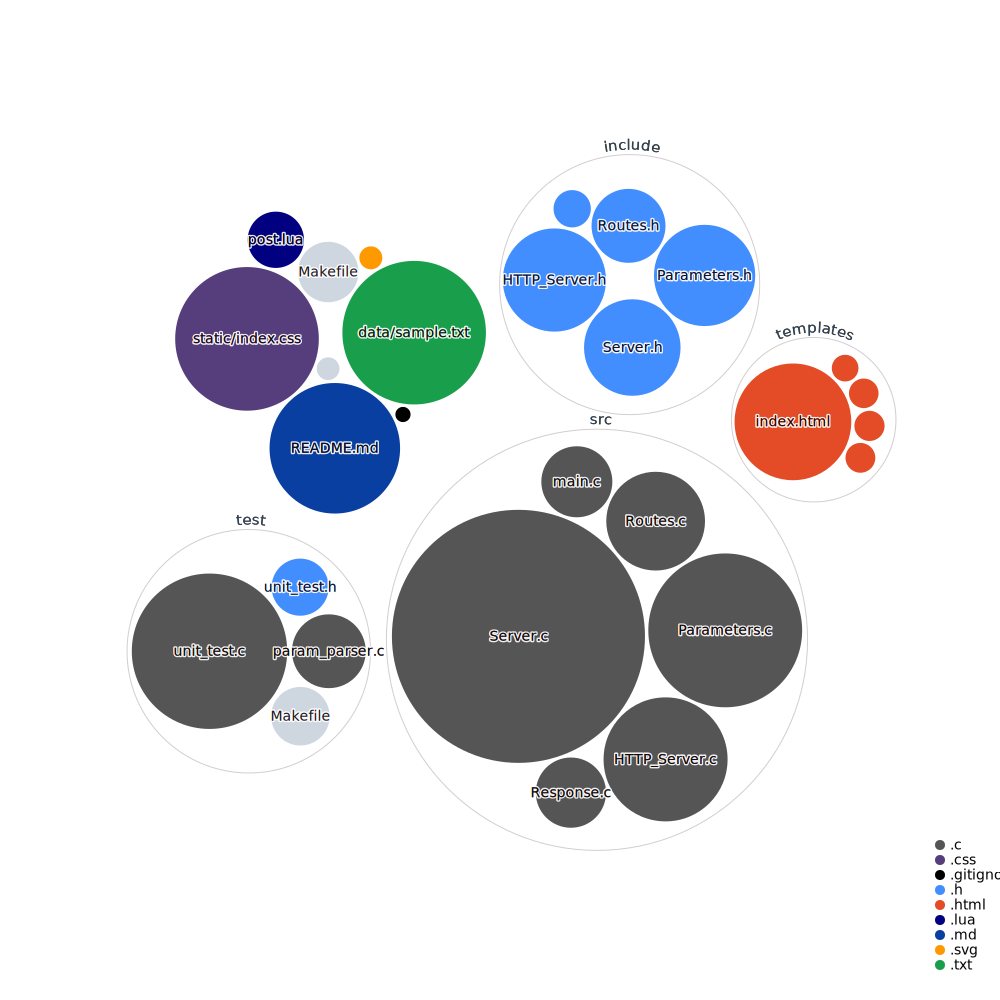
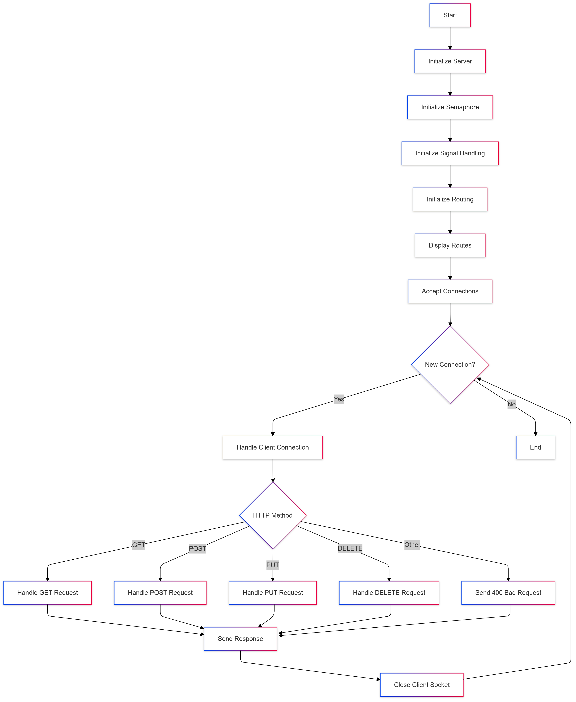

<a name="top"></a>
[](https://en.wikipedia.org/wiki/C_(programming_language))
[](https://en.wikipedia.org/wiki/Fork_(system_call))
[](https://www.gnu.org/software/make/)
[](https://docs.microsoft.com/en-us/windows/wsl/)
[](https://www.ietf.org/rfc/rfc2616.txt)
[](https://en.wikipedia.org/wiki/Internet_Protocol_Suite)
[](https://en.wikipedia.org/wiki/Linux)
[](https://shields.io/)
[](https://azure.microsoft.com/en-us/)
[](https://github.com/ThrowTheSwitch/Unity)


# HTTP Server Project 🚀

This project implements a simple HTTP server in C. It includes functionalities for routing, parameter parsing, and serving static files.

## Table of Contents
- [Visualization of this repo 📊](#visualization-of-this-repo-)
- [Features 🌟](#features-)
- [Files 📁](#files-)
- [Getting Started 🛠️](#getting-started-️)
    - [Prerequisites ⚙️](#prerequisites-️)
    - [Installation 💾](#installation-)
    - [Request Handling 📡](#request-handling-)
    - [Running Unit Tests 🧪](#running-unit-tests-)
- [Program Flow 🌀](#program-flow-)
- [Authors ✍️](#program-flow)


## Visualization of this repo 📊




## Features 🌟

- **HTTP Request Handling (GET, POST, PUT, DELETE)**: Handle various HTTP request methods.
- **Routing Management with Binary Search Tree (BST)**: Efficiently manage routes using a BST.
- **URL Input Validation**: Validate URL inputs to ensure they are well-formed.
- **Child Process Handling with Fork and Semaphore**: Manage child processes using `fork()` and semaphores for concurrency.
- **Logging and Debugging**: Log server activities and debug information.
- **Unit Testing for Function Validation**: Validate server functions using unit tests.
- **Zombie Processes Handling**: Properly handle zombie processes to prevent resource leaks.


## Files 📁

- **HTTP_Server.c**: Contains functions to initialize the server, set status codes, and set response bodies.
- **Routes.c**: Manages routes using a binary search tree structure.
- **Parameters.c**: Handles dynamic parameter arrays, including initialization, addition, sorting, and retrieval.
- **main.c**: The main entry point of the server, handling client connections and requests.
- **Server.c**: The main entry point for the server. Handles client connections, request parsing, and dispatching requests to appropriate handler functions.
- **Response.c**: Contains functions for rendering static files and setting up the HTTP response body.


## Getting Started 🛠️
Follow these steps to set up and run the HTTP server on your machine.

### Prerequisites ⚙️
- Windows Subsystem for Linux (WSL)
- GCC Compiler

### Installation 💾
1. Install WSL:
```shell
wsl --install
```
2. Clone the Repository:
```shell
git clone https://github.com/codeyzx/simple-webserver.git
cd simple-webserver
```
2. Build the Project:
```shell
make
```
3. Run the Server:
```shell
./build/webserver
```

### Request Handling 📡
In this HTTP Server Project, HTTP method testing using curl is performed to send HTTP requests to a running server, to verify that the server can properly handle various types of HTTP requests.
1. Method GET

Example:
```shell
curl http://localhost:6969/about
```
2. Method POST

Example:
```shell
curl -X POST http://localhost:6969/echo -H "Content-Type: application/json" -d '{"message": "Hello, Server!"}'
```
3. Method PUT

Example:
```shell
curl -X PUT http://localhost:6969/sample.txt -d '{"name": "amadeus", "age": 10}' --output -
```
4. Method DELETE

Example:
```shell
curl -X DELETE http://localhost:6969/chicken.txt --output -
```


### Running Unit Tests 🧪
Unit tests are included to ensure the server functions as expected.
1. Navigate to the test directory:
```shell
cd test
```
2. Run the tests:
```shell
make run_tests
```


## Program Flow 🌀



## Authors ✍️

1. Yahya Alfon Sinaga (231524064)
2. Amadeus (231524050)

[Back to top](#top)