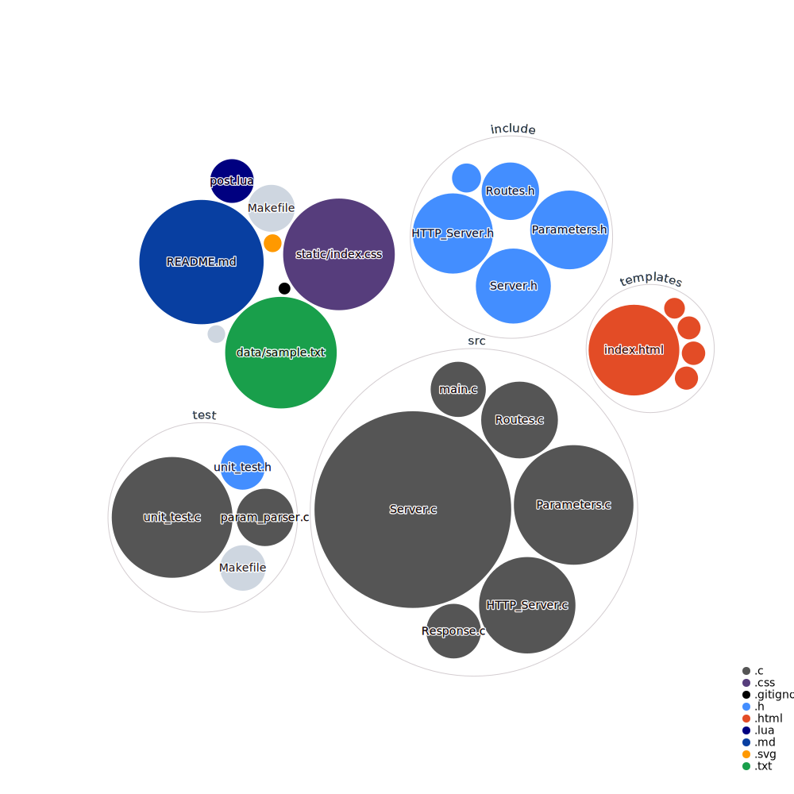

# HTTP Server Project

This project implements a simple HTTP server in C. It includes functionalities for routing, parameter parsing, and serving static files.

## Visualization of this repo

## Features

- **HTTP Server Initialization**: Initialize and configure the server to listen on a specified port.
- **Routing**: Define and manage routes to serve different HTML files.
- **Parameter Parsing**: Parse URL parameters and manage them dynamically.
- **Static File Serving**: Serve static files such as CSS.

## Files

- **HTTP_Server.c**: Contains functions to initialize the server, set status codes, and set response bodies.
- **Routes.c**: Manages routes using a binary search tree structure.
- **Parameters.c**: Handles dynamic parameter arrays, including initialization, addition, sorting, and retrieval.
- **main.c**: The main entry point of the server, handling client connections and requests.

## Authors

1. Yahya Alfon Sinaga (231524064)
2. Amadeus (231524059)
